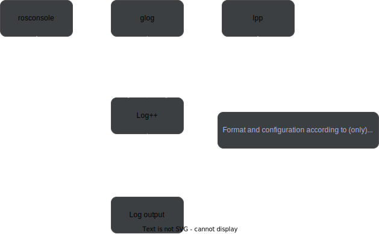

# Log++ Logging framework



***

## Features

- Framework to standardize ros and glog output at compile time.
- Uses ros/glog's native log calls depending on selected mode.
- Customize log output
- All log calls are thread-safe.
- Lightweight with performance in mind
- Header only
- Recommended to use with C++17, but also works with C++11 when compiling with GCC.

## Example

`src/demo.cpp`
```c++
#include <log++.h>

int main(int argc, char **argv) {
  LOG_INIT(argv[0]);
  int foo = 5;
  
  LOG(I, "Foo: " << foo);           //Log++ syntax
  ROS_INFO_STREAM("Foo: " << foo);  //ROS syntax
  LOG(INFO) << "Foo: " << foo;      //Glog syntax
  return 0;
}
```
### Output with different flags

- MODE_DEFAULT:

```shell
INFO  Foo: 5
[ INFO] [1664445448.151401926]: Foo: 5
I0929 11:57:28.151427 1360708 main.cpp:8] Foo: 5
```

- MODE_LPP:

```shell
INFO  Foo: 5
INFO  Foo: 5
INFO  Foo: 5
```

- MODE_GLOG:

```shell
I0929 11:57:50.238454 1360823 main.cpp:6] Foo: 5
I0929 11:57:50.238514 1360823 main.cpp:7] Foo: 5
I0929 11:57:50.238536 1360823 main.cpp:8] Foo: 5
```

- MODE_ROSLOG:

```shell
[ INFO] [1664445486.584182057]: Foo: 5
[ INFO] [1664445486.584212352]: Foo: 5
[ INFO] [1664445486.584240476]: Foo: 5
```

## Installation

### Option 1: Copy the header
1. Copy the header file `include/log++.h` to your project.

2. Add the following line to `CMakeLists.txt` to select the desired mode for...

- a project:

```cmake
# Valid modes are: MODE_LPP MODE_GLOG MODE_ROSLOG MODE_DEFAULT
# Use add_definitions(-DMODE_LPP) if cmake version <= 3.11

add_compile_definitions(MODE_LPP)
```

- a specific executable or library:

```cmake
target_compile_definitions(my_executable PRIVATE MODE_LPP) 
```

### Option 2: Add Log++ as a submodule
1. Add Log++ as a submodule with following command:
```shell
$ git submodule add git@github.com:ethz-asl/lpp.git
```

2. Add following lines in `CMakeLists.txt`

```cmake
add_subdirectory(my_submodule_dir/lpp)
add_executable(my_executable main.cpp)
target_link_libraries(my_executable Log++)
```

3. To update Log++ to the latest commit, execute the following commands:

From submodule directory
```shell
$ git pull origin master
```

From parent directory
```shell
$ git add path/to/submodule_dir
```


### Option 3: Build as catkin package
1. Clone the package into the catkin workspace

```shell
$ git clone git@github.com:ethz-asl/lpp.git
```

2. Build package
```shell
$ catkin build lpp
```

# Usage

## Modes

- **MODE_LPP** Log++ Logging output.
- **MODE_GLOG:** Google Logging output. Calls abort() if it logs a fatal error.
- **MODE_ROSLOG:** ROS Logging output.
- **MODE_DEFAULT:** Disables Logging standardization. Messages are logged according to their framework.

## How severity levels should be used

- **Debug:** Everything too verbose during normal execution and can be ignored.
- **Info:** Everything that could be of interest during a normal execution, but could also be ignored.
- **Warning:** Things that may need attention, but are probably not dangerous.
- **Error:** Things that need attention and probably are dangerous if not handled.
- **Fatal:** Everything that should stop execution immediately.

> **Note for glog:**
>
> - When using with **MODE_ROSLOG** or **MODE_LPP**, the macros DLOG(severity) and VLOG() will get converted
> to debug severity.
>
> - When using with **MODE_GLOG**, the Log++ and Roslog debug macros LOG(D) and ROS_DEBUG() will get converted
> to DLOG(INFO).
>
> - Fatal log messages call abort(). (glog only)

## Log++ Syntax

Log++ provides its own logging functions, if you want to use Log++ as the base logging framework

### Default logging

```c++
int foo = 1;
int bar = 3;
LOG(I, "Values: " << foo " " << bar);
```

### Conditional logging

```c++
int foo = 1;
int bar = 3;
LOG(I, foo != bar, "Values: " << foo << " " << bar)
```

### Occasional logging

```c++
int foo = 1;
int bar = 3;

for (int i = 0; i < 50; i++) {
  LOG_EVERY(I, 20, "Values: " << foo << " " << bar) // Log every 20 calls.
}
```

### Logging first N occurrences

```c++
int foo = 1;
int bar = 3;

for (int i = 0; i < 10; i++) {
  LOG_FIRST(I, 5, "Values: " << foo << " " << bar) //Log first 5 calls.
}
```

### Log output customization
Log++ also allows you to customize the log output with a callback function when using
MODE_LPP:

```c++
void logCallback(BaseSeverity severity, const std::string& str) {
  std::cout << str << std::endl;
}

int main(int argc, char **argv) {
  LOG_INIT(argv[0], logCallback);
  ...
}
```

## Overview of logging methods

| Method                      | Log++                | Glog                          | ROS                         | 
|-----------------------------|----------------------|-------------------------------|-----------------------------|
| Default logging             | LOG(I, str)          | LOG(INFO) << str              | ROS_INFO(str)               |
| Conditional logging         | LOG(I, cond, str)    | LOG_IF(INFO, cond) << str     | ROS_INFO_COND(cond, str)    |
| Occasional logging          | LOG_EVERY(I, n, str) | LOG_EVERY_N(INFO, n) << str   | -                           |
| Timed logging               | LOG_TIMED(I, t, str) | LOG_EVERY_T(INFO, t) << str   | ROS_INFO_THROTTLE(t, str)   |
| First N occurrences         | LOG_FIRST(I, n, str) | LOG_FIRST_N(INFO, n) << str   | ROS_INFO_ONCE(str) (only 1) |
| Log to std::vector\<string> | -                    | LOG_STRING(INFO, &vec) << str | -                           |

## TODOs
- Implement ROS_INFO_NAMED() etc.

# Testing

- All modes (default, glog, lpp, roslog) have a separate test suite
- All severity levels (Debug, Info, Warning, Error, Fatal)
- All logging methods (Default, Conditional, Occasional, Timed, First N occurrences)
- Tests must run in debug mode in order to test debug log output

Naming Convention:

```c++
TEST(<mode>_<LoggingMethod>, <mode>_syntax_severity_<severity>) {
  //Test logic
}
```
